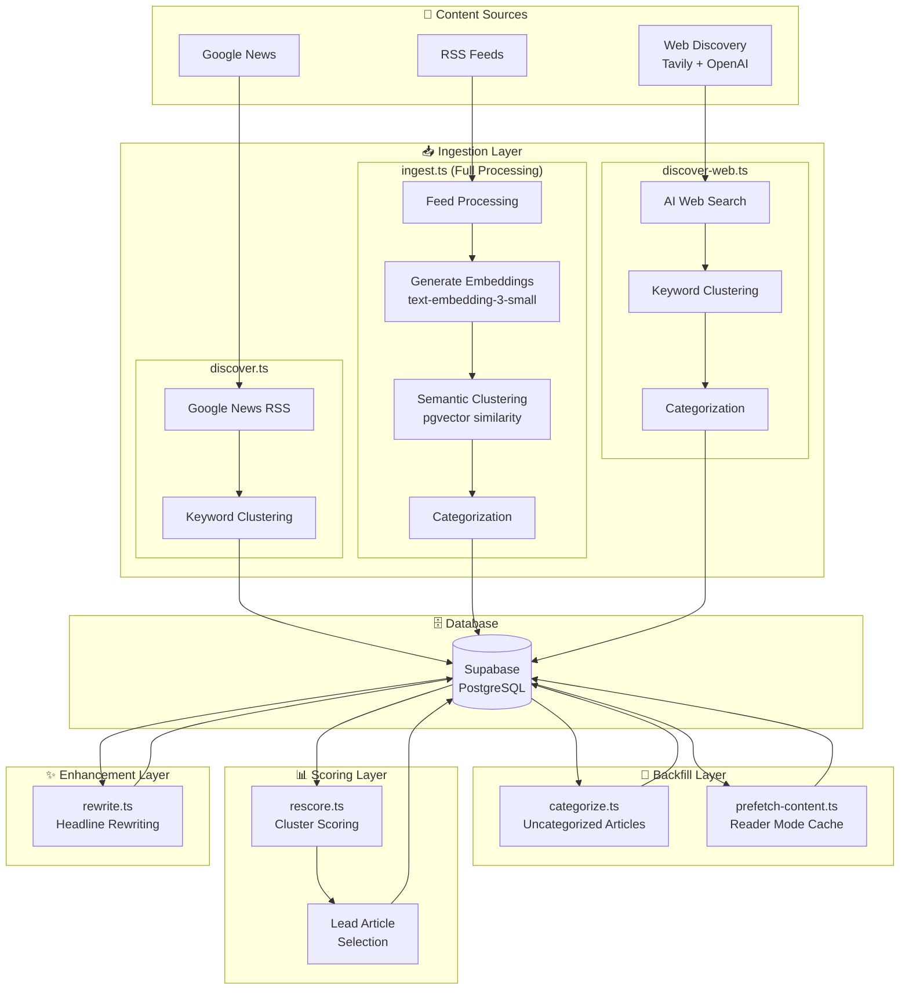
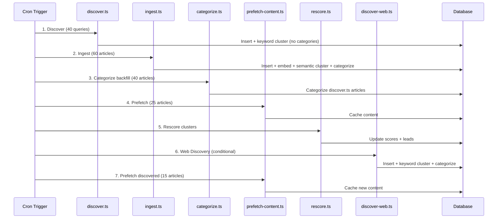
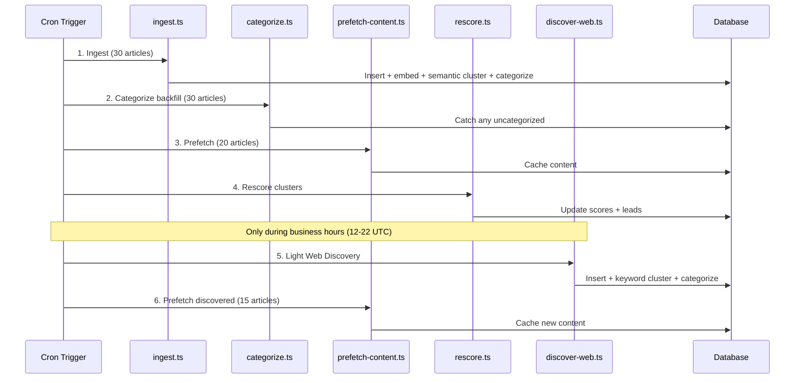
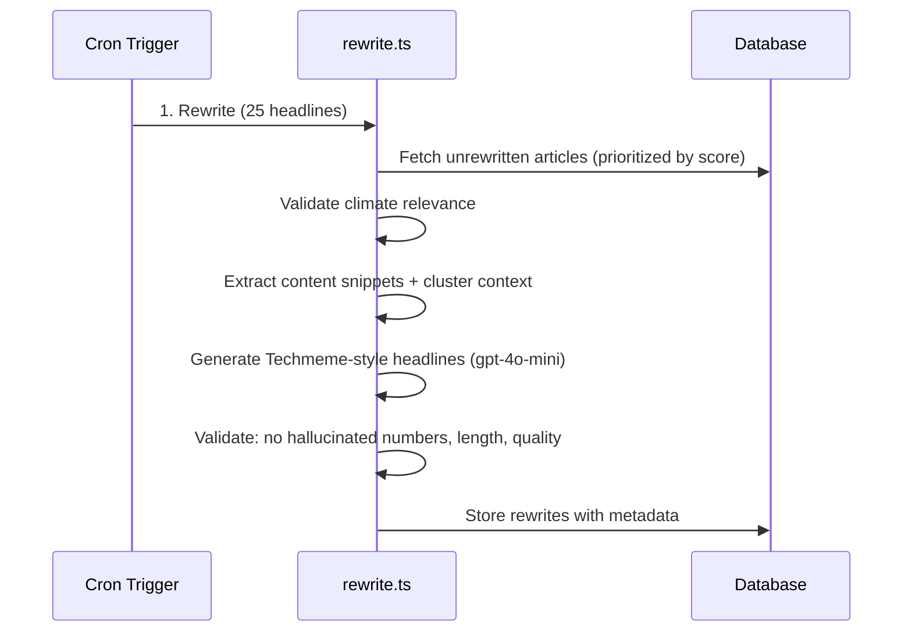
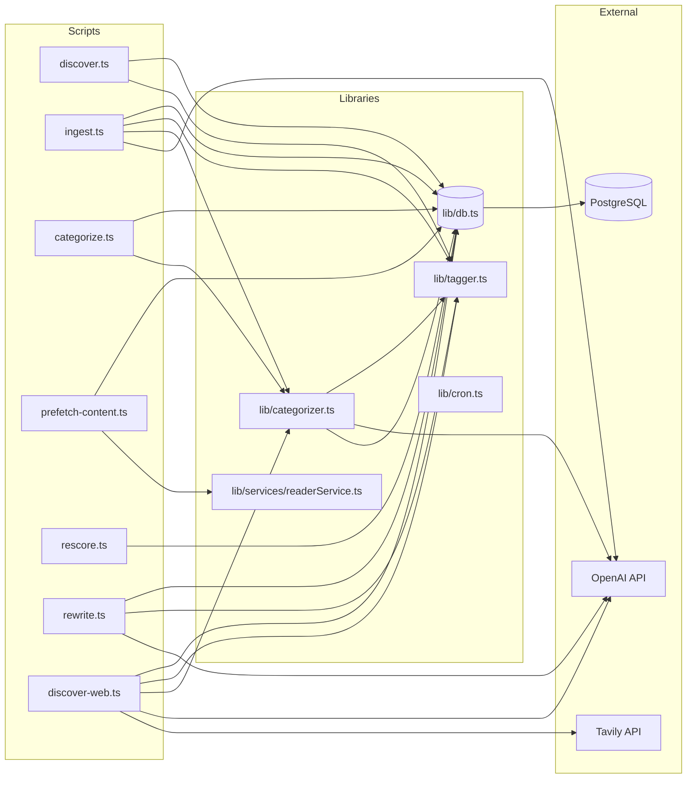
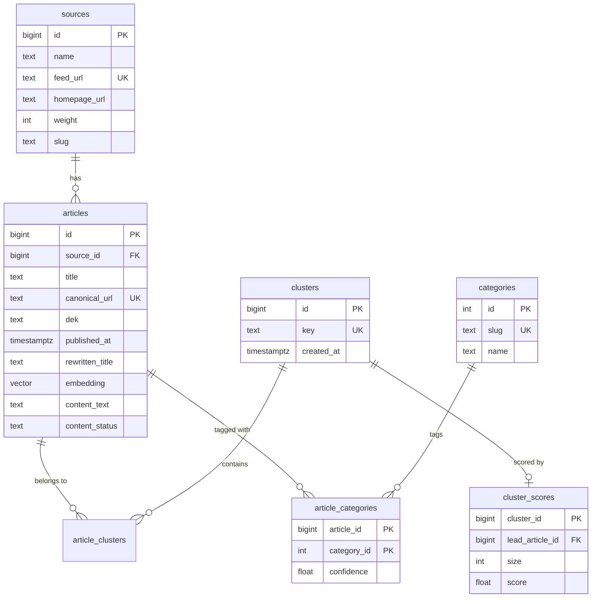
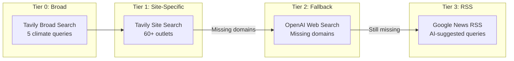

# Climate River

Minimal, fast climate news river. Next.js (App Router) + Tailwind + Postgres (Supabase).

Built by [Dylan Wahbe](https://dylanwahbe.com).

## Pipeline Architecture

Climate River uses a multi-stage data pipeline orchestrated by three Vercel cron jobs that run at different frequencies and intensities.

### Cron Schedule Overview

```mermaid
gantt
    title Daily Cron Schedule (UTC)
    dateFormat HH
    axisFormat %H:00

    section Full Cron
    Full (5min)    :f1, 01, 1h
    Full (5min)    :f2, 10, 1h
    Full (5min)    :f3, 20, 1h

    section Refresh Cron
    Refresh (2min) :r1, 00, 1h
    Refresh (2min) :r2, 04, 1h
    Refresh (2min) :r3, 12, 1h
    Refresh (2min) :r4, 16, 1h
    Refresh (2min) :r5, 18, 1h
    Refresh (2min) :r6, 22, 1h

    section Rewrite Cron
    Rewrite (1min) :w1, 00, 1h
    Rewrite (1min) :w2, 03, 1h
    Rewrite (1min) :w3, 07, 1h
    Rewrite (1min) :w4, 11, 1h
    Rewrite (1min) :w5, 12, 1h
    Rewrite (1min) :w6, 13, 1h
    Rewrite (1min) :w7, 14, 1h
    Rewrite (1min) :w8, 15, 1h
    Rewrite (1min) :w9, 16, 1h
    Rewrite (1min) :w10, 17, 1h
    Rewrite (1min) :w11, 18, 1h
    Rewrite (1min) :w12, 19, 1h
    Rewrite (1min) :w13, 20, 1h
    Rewrite (1min) :w14, 21, 1h
    Rewrite (1min) :w15, 22, 1h
    Rewrite (1min) :w16, 23, 1h
```



| Cron        | Schedule                                      | Timeout | Purpose                                        |
| ----------- | --------------------------------------------- | ------- | ---------------------------------------------- |
| **Full**    | 01:00, 10:00, 20:00 UTC                       | 5 min   | Comprehensive pipeline with discovery + web AI |
| **Refresh** | 00:00, 04:00, 12:00, 16:00, 18:00, 22:00 UTC  | 2 min   | Quick content refresh                          |
| **Rewrite** | 00:00, 03:00, 07:00, 11:00-23:00 hourly (16×) | 1 min   | Dedicated headline rewriting                   |

### Pipeline Flow



### Full Cron Pipeline

The full cron (`/api/cron/full`) runs the complete pipeline:



### Refresh Cron Pipeline

The refresh cron (`/api/cron/refresh`) runs a lighter pipeline more frequently:



### Rewrite Cron Pipeline

The rewrite cron (`/api/cron/rewrite`) runs headline enhancement independently:



### Script Details

| Script                | Purpose                 | AI Model                 | Clustering              | Categorization | Key Features                                                 |
| --------------------- | ----------------------- | ------------------------ | ----------------------- | -------------- | ------------------------------------------------------------ |
| `discover.ts`         | Google News RSS         | —                        | Keyword                 | ❌             | 14 climate queries, relevance filtering                      |
| `ingest.ts`           | RSS feed processing     | `text-embedding-3-small` | **Semantic** (pgvector) | ✅ Inline      | Full pipeline: dedup, embeddings, clustering, categorization |
| `discover-web.ts`     | AI web discovery        | `gpt-4o-mini` + Tavily   | Keyword                 | ✅ Inline      | Multi-tier search, 60+ curated outlets                       |
| `categorize.ts`       | Backfill categorization | Hybrid rules + AI        | —                       | ✅             | Catches uncategorized articles (e.g., from discover.ts)      |
| `prefetch-content.ts` | Reader mode cache       | —                        | —                       | —              | Content extraction, paywall detection                        |
| `rescore.ts`          | Cluster scoring         | —                        | —                       | —              | Freshness decay (6h/9h half-life), velocity, coverage        |
| `rewrite.ts`          | Headline enhancement    | `gpt-4o-mini`            | —                       | —              | Techmeme-style, fact validation, no hallucinated numbers     |

**Clustering Methods:**

- **Semantic Clustering** (ingest.ts only): Uses pgvector cosine similarity on embeddings to group articles about the same story, even with different wording
- **Keyword Clustering** (discover.ts, discover-web.ts): Groups by extracted keywords from title - faster but less accurate

### Function Call Graph

```mermaid
flowchart TB
    subgraph Cron["🕐 Cron Entry Points"]
        FULL["/api/cron/full"]
        REFRESH["/api/cron/refresh"]
        REWRITE_CRON["/api/cron/rewrite"]
    end

    subgraph CronLib["lib/cron.ts"]
        safeRun["safeRun()"]
        authorized["authorized()"]
    end

    FULL --> authorized
    REFRESH --> authorized
    REWRITE_CRON --> authorized
    FULL --> safeRun
    REFRESH --> safeRun
    REWRITE_CRON --> safeRun

    subgraph DiscoverScript["scripts/discover.ts"]
        disc_run["run()"]
        disc_ingestQuery["ingestQuery()"]
        disc_insertArticle["insertArticle()"]
        disc_ensureCluster["ensureClusterForArticle()"]
        disc_clusterKey["clusterKey()"]

        disc_run --> disc_ingestQuery
        disc_ingestQuery --> disc_insertArticle
        disc_ingestQuery --> disc_ensureCluster
        disc_ensureCluster --> disc_clusterKey
    end

    subgraph IngestScript["scripts/ingest.ts"]
        ing_run["run()"]
        ing_ingestFromFeed["ingestFromFeed()"]
        ing_generateEmbedding["generateEmbedding()"]
        ing_insertArticle["insertArticle()"]
        ing_semanticCluster["ensureSemanticClusterForArticle()"]
        ing_updateScore["updateClusterScore()"]

        ing_run --> ing_ingestFromFeed
        ing_ingestFromFeed --> ing_generateEmbedding
        ing_ingestFromFeed --> ing_insertArticle
        ing_insertArticle --> ing_generateEmbedding
        ing_ingestFromFeed --> ing_semanticCluster
        ing_semanticCluster --> ing_updateScore
    end

    subgraph WebDiscoverScript["scripts/discover-web.ts"]
        web_run["run()"]
        web_broadDiscovery["runBroadClimateDiscovery()"]
        web_outletDiscovery["runOutletDiscoverySegment()"]
        web_tavily["searchViaTavily()"]
        web_tavilyBatch["searchViaTavilyBatch()"]
        web_openai["callOpenAIWebSearch()"]
        web_tryInsert["tryInsertDiscoveredArticle()"]
        web_insertArticle["insertWebDiscoveredArticle()"]
        web_ensureCluster["ensureClusterForArticle()"]

        web_run --> web_broadDiscovery
        web_run --> web_outletDiscovery
        web_broadDiscovery --> web_tavily
        web_outletDiscovery --> web_tavilyBatch
        web_outletDiscovery --> web_openai
        web_broadDiscovery --> web_tryInsert
        web_outletDiscovery --> web_tryInsert
        web_tryInsert --> web_insertArticle
        web_tryInsert --> web_ensureCluster
    end

    subgraph CategorizeScript["scripts/categorize.ts"]
        cat_run["run()"]
    end

    subgraph RewriteScript["scripts/rewrite.ts"]
        rew_run["run()"]
        rew_batch["batch()"]
        rew_processOne["processOne()"]
        rew_generateOpenAI["generateWithOpenAI()"]
        rew_passesChecks["passesChecks()"]
        rew_buildPrompt["buildPrompt()"]

        rew_run --> rew_batch
        rew_batch --> rew_processOne
        rew_processOne --> rew_generateOpenAI
        rew_processOne --> rew_passesChecks
        rew_generateOpenAI --> rew_buildPrompt
    end

    subgraph RescoreScript["scripts/rescore.ts"]
        res_run["run()"]
    end

    subgraph PrefetchScript["scripts/prefetch-content.ts"]
        pre_run["run()"]
    end

    subgraph CategorizerLib["lib/categorizer.ts"]
        catLib_store["categorizeAndStoreArticle()"]
        catLib_hybrid["categorizeArticleHybrid()"]
        catLib_storeCategories["storeArticleCategories()"]
        catLib_articleEmbed["generateArticleEmbedding()"]
        catLib_catEmbed["getCategoryEmbedding()"]

        catLib_store --> catLib_hybrid
        catLib_store --> catLib_storeCategories
        catLib_hybrid --> catLib_articleEmbed
        catLib_hybrid --> catLib_catEmbed
    end

    subgraph TaggerLib["lib/tagger.ts"]
        tag_isClimate["isClimateRelevant()"]
        tag_categorize["categorizeArticle()"]
    end

    subgraph ReaderLib["lib/services/readerService.ts"]
        reader_prefetch["prefetchArticles()"]
        reader_getContent["getArticleContent()"]
        reader_fetch["fetchArticleContent()"]

        reader_prefetch --> reader_getContent
        reader_getContent --> reader_fetch
    end

    subgraph DbLib["lib/db.ts"]
        db_query["query()"]
        db_endPool["endPool()"]
    end

    %% Script to lib connections
    safeRun -.-> disc_run
    safeRun -.-> ing_run
    safeRun -.-> cat_run
    safeRun -.-> pre_run
    safeRun -.-> res_run
    safeRun -.-> rew_run
    safeRun -.-> web_run

    disc_ingestQuery --> tag_isClimate
    ing_ingestFromFeed --> tag_isClimate
    ing_ingestFromFeed --> catLib_store
    web_tryInsert --> tag_isClimate
    web_tryInsert --> catLib_store
    cat_run --> catLib_store
    catLib_hybrid --> tag_categorize
    rew_processOne --> tag_isClimate
    pre_run --> reader_prefetch

    %% All scripts use db
    disc_run --> db_query
    ing_run --> db_query
    cat_run --> db_query
    res_run --> db_query
    rew_run --> db_query
    web_run --> db_query
    pre_run --> db_query
    catLib_store --> db_query
```



### Shared Library Dependencies



### Database Schema (Core Tables)



### Scoring Algorithm

Cluster scores determine homepage ranking using a weighted formula:

```
Score = (0.18 × coverage) + (0.05 × avg_weight) + (0.27 × ln(1 + velocity)) + (0.45 × freshness) + (0.05 × pool_strength)
```

Where:

- **Freshness**: Exponential decay with configurable half-lives
  - Articles: 6-hour half-life (lose 50% score every 6 hours)
  - Clusters: 9-hour half-life (25% faster decay for fresher homepage)
- **Velocity**: Articles added in last 4 hours
- **Coverage**: Source diversity + total weighted coverage (using log scaling)
- **Weight**: Source editorial weight (1-5 scale)
- **Pool Strength**: Aggregate article quality within cluster

**Lead Article Selection:**

Articles are scored individually using: `(0.40 × editorial_quality) + (0.60 × freshness)`

Editorial quality includes:

- Source weight (1-5)
- Author presence (+0.25)
- Dek length ≥120 chars (+0.10)
- Google News aggregator penalty (-0.50)
- Press release penalty (-0.60)

### Web Discovery Tiers

The `discover-web.ts` script uses a multi-tier approach:



---

**Copyright © 2026 Dylan Wahbe. All rights reserved.**

This project is **Code Available** - the source code is publicly accessible for learning and reference purposes, but is not open source software. The codebase, design, and intellectual property remain the exclusive property of Dylan Wahbe.
