# Climate River

Minimal, fast climate news river. Next.js (App Router) + Tailwind + Postgres (Supabase).

## Pipeline Architecture

Climate River uses a multi-stage data pipeline orchestrated by two Vercel cron jobs that run at different frequencies and intensities.

### Cron Schedule Overview

```mermaid
gantt
    title Daily Cron Schedule (UTC)
    dateFormat HH
    axisFormat %H:00

    section Full Cron
    Full (5min)    :f1, 01, 1h
    Full (5min)    :f2, 10, 1h
    Full (5min)    :f3, 20, 1h

    section Refresh Cron
    Refresh (2min) :r1, 00, 1h
    Refresh (2min) :r2, 04, 1h
    Refresh (2min) :r3, 12, 1h
    Refresh (2min) :r4, 16, 1h
    Refresh (2min) :r5, 18, 1h
    Refresh (2min) :r6, 22, 1h
```



| Cron        | Schedule                                     | Timeout | Purpose                                          |
| ----------- | -------------------------------------------- | ------- | ------------------------------------------------ |
| **Full**    | 01:00, 10:00, 20:00 UTC                      | 5 min   | Comprehensive pipeline with discovery + rewrites |
| **Refresh** | 00:00, 04:00, 12:00, 16:00, 18:00, 22:00 UTC | 2 min   | Quick content refresh                            |

### Pipeline Flow


### Full Cron Pipeline

The full cron (`/api/cron/full`) runs the complete pipeline:


### Refresh Cron Pipeline

The refresh cron (`/api/cron/refresh`) runs a lighter pipeline more frequently:


### Script Details

| Script                | Purpose                | AI Model                 | Key Features                            |
| --------------------- | ---------------------- | ------------------------ | --------------------------------------- |
| `discover.ts`         | Google News RSS search | —                        | 14 climate queries, relevance filtering |
| `ingest.ts`           | RSS feed processing    | `text-embedding-3-small` | Dedup, embeddings, semantic clustering  |
| `categorize.ts`       | Article categorization | Hybrid rules + AI        | Multi-category tagging                  |
| `prefetch-content.ts` | Reader mode cache      | —                        | Content extraction, paywall detection   |
| `rescore.ts`          | Cluster scoring        | —                        | Freshness decay, velocity, coverage     |
| `rewrite.ts`          | Headline enhancement   | `gpt-4o-mini`            | Techmeme-style, fact validation         |
| `discover-web.ts`     | AI web discovery       | `gpt-4o-mini` + Tavily   | Multi-tier search, 60+ outlets          |

### Database Schema (Core Tables)


### Scoring Algorithm

Cluster scores determine homepage ranking using a weighted formula:

```
Score = (0.18 × coverage) + (0.05 × avg_weight) + (0.27 × ln(1 + velocity)) + (0.45 × freshness) + (0.05 × pool_strength)
```

Where:

- **Freshness**: Exponential decay with 9-hour half-life
- **Velocity**: Articles added in last 4 hours
- **Coverage**: Source diversity + total weighted coverage
- **Weight**: Source editorial weight (1-5 scale)

### Web Discovery Tiers

The `discover-web.ts` script uses a multi-tier approach:


---

**Copyright © 2025 Dylan Wahbe. All rights reserved.**

This project is **Code Available** - the source code is publicly accessible for learning and reference purposes, but is not open source software. The codebase, design, and intellectual property remain the exclusive property of Dylan Wahbe.
